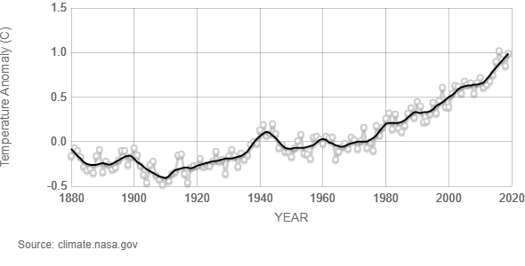
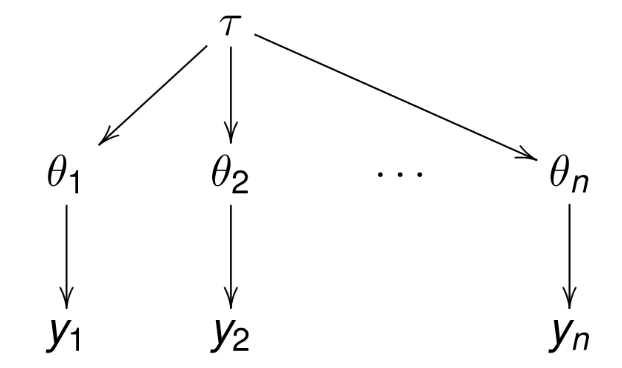

\newpage

# 1. Introduction

One of the biggest challenges of humankind in the 2020s is figuring out ways to slow down the growth of greenhouse gas emissions and stop global warming (due to human activities) under 2 $^{\circ}$C. The increasing trend of global temperature is easily seen in Figure \ref{fig:global_temp} [cite NASA] in which the global surface temperature is illustrated relative to 1951-1980 average temperatures. Warming can also be seen with one's own eyes by observing the winters that are warming year by year, by noticing that the number of devastating hurricanes is increased, and by finding out the increased rate of ice melting in glaciers during summer.

```{r globaltemp, echo=FALSE, fig.cap="\\label{fig:global_temp}Global Land-Ocean Temperature Index", out.width = '100%'}

```

In response to that warming, many countries have declared a climate emergency to emphasize the criticality of the situation. In addition, young people have organized climate demonstrations around the world, politicians are talking more and more about climate change, and presidents and prime ministers are negotiating agreements and commitments to solve this, one of humanity’s greatest, problem.  But what if, despite attempts of negotiation, the necessary CO$_2$ reduction decisions are not achieved?

In this project, our goal is to model the historical emission trends of selected countries as well as attempts to model their future emissions. We are examining a scenario in which emissions continue to develop at a historical rate, and the necessary reductions are not achieved. In our modeling, the other parameters e.g. population growth and technical conditions, are similar to historical data in our modeling. 


# 2. Data description


Our CO$_2$ data was obtained from \textit{Our World in Data} (OWID) web page [cite OWID_net] and the actual \textit{CSV} file from OWID GitHub page [cite OWID_git]. As mentioned earlier, climate change is a hot topic in the daily news, and there is a lot of studies and research concerning how CO$_2$ emissions are influencing global warming. The data set was also used, for example, when researchers studied the climate impact of the different policy recommendation which targeted to reduce greenhouse gases from the atmosphere.

## 2.1 Choosing the sample and estimating it's resemblance

In our modeling, we selected 19 different countries from the OWID data set and examined CO$_2$ data between the years 1950-2018. We decided to not take all countries into the modeling as the are holes and missing information in the dataset. The countries we chose cover the whole globe and are roughly evenly distributed across continents. However, we estimated that the data is probably more reliable in the western countries and thus were more open-minded in selecting them. Even that said, we think that the geographical distribution covers the whole world pretty well. Another important aspect of division is the division between large and small emitters. Even though it is quite difficult to perform such division, we tried to take countries from both ends pretty evenly. However, it is worth noting that this division was performed intuitively and it does not rely on any actual metrics. Lastly, we thought that the division between developing and western countries is extremely important to consider too. Therefore, this aspect was taken into account when considering the sample countries, too. We estimated that the number of developing countries in the world exceeds the number of western countries and thus tried to choose developing countries a bit more into the sample set.

For the reasons presented above, we believe that the sample we use in this project, resembles the situation in the world quite well. However, we estimated that it is possible that the sample is slightly biased towards western countries. It is important to note this since we examine results where the CO2-emissions data is standardized with the countries' population. As the CO2-emissions are standardized, the importance of correct ratio (number) of countries between different division-aspects increases. As the sample may
be a bit biased, the results may propose higher numbers of CO2-emissions per capita in the world than what they actually are.

## 2.2 Plotting the sample

Below is plotted three graphs. On the first row, we investigate our sample countries' CO2-emissions by country. Please note
the y-axis difference between large and small emitters in the graphs. It is worth noting that the CO2-emissions development of China
is very concerning as it has almost doubled its CO2-emissions during the last 15 years. In addition, India, Greece, Morocco, Peru and Mongolia has been showing a bit concerning trend during last decades.

On the second row, we plotted the sample countries' emission standardized with the population of the country. Thus, we obtained
a "CO2 per capita" -estimate for each country. This is the data that we used later in our models. Especially between 1950s and 70s, western countries play significant role as the big emitters. However, during 2000s, the situation has changed as western countries have systematically been able to lower their emissions per capita. At the same time, developing countries have been increasing their
emissions and thus the situation has tied.

```{r echo=FALSE, message=FALSE}
library(rstan)
library(ggplot2)
library(reshape2)
library(gridExtra)
library(tidyr)
library(bayesplot)
library(dplyr)
```

```{r echo=FALSE}
# Read data to data frame
data_co2 <- read.csv("./data_co2.csv")
data_population <- head(read.csv("./data_population.csv"), -1)
data_co2_population = data_co2*10^6/data_population

# We discovered that the CO2-emissions difference between our selected countries is so vast
# that it's better to split the data into two different plots.

df_data1 <- data_co2[, (data_co2[dim(data_co2)[1], ]) >= 100]
df_data1 <- df_data1[,order(df_data1[69,])]
df_data1_2 <- data.frame(years=seq(1950,2018), df_data1)
df_plot1 <- melt(data = df_data1_2, id.vars = "years", variable.name = "Country")


df_data2 <- data_co2[, (data_co2[dim(data_co2)[1], ]) < 100]
df_data2 <- df_data2[,order(df_data2[69,])]
df_data2_2 <- data.frame(years=seq(1950,2018), df_data2)
df_plot2 <- melt(data = df_data2_2, id.vars = "years", variable.name = "Country")

# Population
# df_data3 <- data.frame(years=seq(1950,2018), data_population)
# df_plot3 <- melt(data = df_data3, id.vars = "years", variable.name = "Country")


df_data4 <- data.frame(years=seq(1950,2018), data_co2_population)
df_data4 <- df_data4[,order(df_data4[69,])]
df_plot4 <- melt(data = df_data4, id.vars = "years", variable.name = "Country")

# df_data5 <- data_c02_population[, (data_co2[dim(data_co2)[1], ]) < 100]
# df_data5 <- df_data5[,order(df_data5[69,])]
# df_data5_2 <- data.frame(years=seq(1950,2018), df_data5)
# df_plot5 <- melt(data = df_data5_2, id.vars = "years", variable.name = "Country")


plot1 <- ggplot(df_plot1, aes(x=years, y=value, colour=Country)) +
        geom_line() +
        ggtitle("Plot 1. \nSample countries' CO2-emissions: \nbig emitters") +
        xlab("Year") +
        ylab("CO2-emissions / Billion tonns") +
        labs(colour = "IOC Country Code") +
        theme(
          axis.title.x = element_text(face = "bold"),
          axis.title.y = element_text(face = "bold"))

plot2 <- ggplot(df_plot2, aes(x=years, y=value, colour=Country)) +
        geom_line() +
        ggtitle("Plot 2. \nSample countries' CO2-emissions: \nsmall emitters") +
        xlab("Year") +
        ylab("CO2-emissions / Billion tonns") +
        labs(colour = "IOC Country Code") +
        theme(
          axis.title.x = element_text(face = "bold"),
          axis.title.y = element_text(face = "bold"))

# plot3 <- ggplot(df_plot3, aes(x=years, y=value, colour=Country)) +
#         geom_line() +
#         ggtitle("Selected countries' population development") +
#         xlab("Year") +
#         ylab("Population")

plot4 <- ggplot(df_plot4, aes(x=years, y=value, colour=Country)) +
        geom_line() +
        ggtitle("Plot 3. \nStandardized CO2-emissions") +
        xlab("Year") +
        ylab("CO2 Per Capita / Kilo tonns") +
        labs(colour = "IOC Country Code") +
        theme(
          axis.title.x = element_text(face = "bold"),
          axis.title.y = element_text(face = "bold"))

# plot5 <- ggplot(df_plot5, aes(x=years, y=value, colour=Country)) +
#         geom_line() +
#         ggtitle("co2 / Population development small") +
#         xlab("Year") +
#         ylab("co2 per capita")
```

```{r fig1, fig.height=12, fig.width=10, fig.align="center", echo=FALSE}

grid.arrange(
  grobs = list(plot1, plot2, plot4),
  layout_matrix = rbind(c(1, 1, 2, 2),
                        c(3, 3, 3, 3),
                        c(3, 3, 3, 3))
)
#plot5
```

# 3 Model description

In this chapter, we will present our model structures and stan codes of our implementation of a non-hierarchical pooled model and a hierarchical model. Before this, we briefly introduce the mathematical structure behind the models.

## 3.1 Pooled model

A pooled model is one of the most straightforward model structure to understand. In the pooled model, all data points are used as one "pool" without considering groups or particular features different pieces of data could have. The whole dataset is used as a one, and modeling is done based on that collection of data. If we assume that priors of the mean and standard deviation follow standard normal distributions, we can present the mathematical structure of the pooled model in the form

$$
\begin{align} \label{eq1}
     \mu & \sim N(0,1) \\
     \sigma & \sim N(0,1) \\
     y_i & \sim N(\mu,\sigma).
\end{align}
$$

We used these standardized normal priors just for illustration purposes, and the correct choice of priors we utilized when modeling is presented in chapter 4. Respectively, the pooled model's implementation with probabilistic programming language *Stan* is presented in chapter 5. 

## 3.2 Hierarchical normal model

Unlike the previous model, the hierarchical model takes into account the possibility that some of the subgroups of the whole dataset have similar properties. Due to this observation, the hierarchical model presents a “hyper-prior” that is common to each group. For each group, its posterior distribution of mean is calculated using that hyper-prior, taking into account only all samples belonging to that group. This property can be illustrated in Figure \ref{fig:hier_sketch}. In Figure \ref{fig:hier_sketch}, $\tau$ is a hyper-parameter and $\theta_i$s presents modeled parameter of each group.

```{r hier, echo=FALSE, fig.cap="\\label{fig:hier_sketch}A hierarchical model -- ", out.width = '100%'}

```

We can summarize the hierarchical model mathematically as

$$
\begin{align}\label{eq2}
     \mu_0 & \sim N(0,1) \\
     \sigma_0 & \sim N(0,1) \\
     \mu_i & \sim N(\mu_0, \sigma_0) \\
     \sigma & \sim N(0,1) \\
     y_{ji} & \sim N(\mu_i,\sigma)
\end{align}
$$

where $mu_0$ and $sigma_0$ are hyper-priors for mean and standard deviation. Again, we used these normal distributions just for illustration purposes. In addition, we assumed through the project that all the groups have a common variance ($\sigma$ in [\ref{eq2}]).

# 4. Priors


# 5. Stan
data {
  int <lower=0> N; // number of observations
  vector[N] y; // observations
}

parameters {
  real mu;
  real<lower=0> sigma;
}

model {
    mu ~ lognormal(0, 10); // priors from last week
    sigma ~ inv_chi_square(1); // priors from last week
  
  
  // pooled model likelihood, common mu and sigma for all observations
    y ~ normal(mu, sigma);
}


generated quantities {
    real ypred;
    vector[N] log_lik;
  
  //predictive distribution for any machine
    ypred = normal_rng(mu, sigma);
  
    for (i in 1:N){
      log_lik[i] = normal_lpdf(y[i] | mu, sigma);
    }
}

## 5.2 Hierarchical model

Example code for hierarchical model

data {
    int<lower=0> N;            // Number of observations
    int<lower=0> N_c;          // Number of countries
    vector[N_c] y[N];               // Observations
}

parameters {
    vector[N_c] mu; // group means
    real hyper_mu;             // prior mean
    real<lower=0> hyper_sigma; // prior std constrained to be positive
    real<lower=0> sigma;  // COMMON std constrained to be positive
    
}

model {
    hyper_mu ~ normal(0, 100);     // weakly informative hyper-prior
    hyper_sigma ~ inv_chi_square(1);   // weakly informative hyper-prior
    
    mu ~ normal(hyper_mu, hyper_sigma); // population prior with unknown parameters   
    sigma ~ inv_chi_square(1); // weakly informative prior for group (common) std
    
    for (j in 1:N_c) {
          y[ ,j] ~ normal(mu[j], sigma); // likelihood
    }
    
}

generated  quantities {
    real y_pred;
    vector[N_c] log_lik[N];
    
    
    y_pred = normal_rng(hyper_mu, sigma);
    
    for (j in 1:N_c) {
        for (i in 1:N) {
            log_lik[i, j] = normal_lpdf(y[i,j] | mu[j], sigma);
        }
    }
}


# 6. Model running
The non-hierarchical and hierarchical stan models from chapter 5 are compiled and sampled in this section. We will explain the used parameters as the section proceed.
```{r message=FALSE}

df_data <- data.frame(years=seq(1950,2018), data_co2_population)
df_plot <- melt(data = df_data, id.vars = "years", variable.name = "country")
vectored_data_pop <- data.frame(df_plot[,'value'])
N <- nrow(vectored_data_pop)


num_of_iter <- 1000
num_of_warmup <- 200

pool_data <- list(N = N,
                  y = vectored_data_pop[,1])

pool_model <- rstan::stan_model(file = "pooled_model_stan_without_loglik.stan")

pool_fit <- rstan::sampling(object = pool_model,
                            data = pool_data,
                            iter = num_of_iter,
                            warmup = num_of_warmup,
                            refresh = 0)
```

We need the total number of observations to be able to run the pooled model, and it's saved to variable N. Vectored version of data is also required by the pooled model. We chose 1000 as the number of iterations per chain, as it has also worked relatively reliably in previous work on the course. We used one fifth of the iterations in the warm-up sample to ensure that the chains were close to the maximum probability mass when true iterations start. At this point, the model without logarithmic likelihood is used to make code compiling faster. Lots of more information about function *stan::stan_model* and *stan::sampling* is found from RStan documentation. 

```{r message=FALSE}

hier_data <- list(N = nrow(data_co2_population),
                  N_c = ncol(data_co2_population),
                  y = data_co2_population)


hier_model <- rstan::stan_model(file = "hier_model_stan_without_loglik.stan")

hier_fit <- rstan::sampling(object = hier_model,
                            data = hier_data,
                            iter = num_of_iter,
                            warmup = num_of_warmup,
                            refresh = 0)

```

When running the hierarchical model, the CO$_2$ data is given in matrix form. The number of iterations and the number of warm-ups is the same as in the pooled model presented above. One group is the one country in this model, so the number of groups is the same as the number of columns in data.

# 7. Convergence diagnostics

We can inspect the convergence of variables using, for example, quantity $\hat{R}$ and quantity \emph{effective sample size} (ESS). Lets start from the pooled model:
```{r}
monitor(pool_fit)
monitor(hier_fit)
```
The 


```{r}
pooled_plotters <- function() {
  pooled_df =data.frame(rstan::extract(pool_fit, permuted=T))
  
  #Histogram
  hist(pooled_df$mu, 
       breaks = 100,
       xlim=c(0,22),
       xlab = "Mean of the quality measurements",
       col = "lightyellow",
       main="Posterior distribution of the mean of the sixth machine")
}
```

```{r}
hierarchical_plotters <- function() {
  hierarchical_df =data.frame(rstan::extract(hier_fit, permuted=T))
  
  #MCMC Areas
  mcmc_areas_df <- hierarchical_df %>% select(starts_with('mu')) %>%
                    setNames(colnames(data_co2_population))
  mcmc_areas(mcmc_areas_df) + xlab("Testttttttt")
  
  #Histograms of countries together
  m <- 19
  {
  plot(0,0,type="n",
        xlim=c(0,20), ylim=c(0,1100),
        xlab="x",ylab="freq", 
        main="Histograms of each country separately, plotted together")
    for(n in 1:m) {
      var_name <- paste("mu.",n, sep="")
      #hier_matrix[n,] <- unlist(hierarchical_df[var_name])
      plot(
        hist(unlist(hierarchical_df[var_name]), breaks = 12, plot=FALSE),
        col=alpha('blue', 0.25),
        add=T # Add to main plot
        )  
    }
  }
  
  #One histogram for whole data
  one_hist_data <- unlist(hierarchical_df %>% select(starts_with('mu')))
  plot(hist(one_hist_data, breaks = 100, xlim = c(0,22), ylim = c(0, 5000)),
            col = 'lightblue')

}

```


# References

