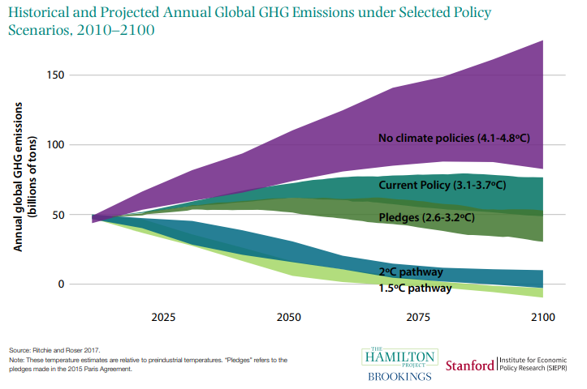

\newpage

# 1. Introduction

One of the biggest challenges of humankind in the 2020s is figuring out ways to slow down the growth of greenhouse gas emissions and stop global warming (due to human activities) under 2 $^{\circ}$C. The increasing trend of global temperature is easily seen in Figure \ref{fig:global_temp} [cite NASA] in which the global surface temperature is illustrated relative to 1951-1980 average temperatures. Warming can also be seen with one's own eyes by observing the winters that are warming year by year, by noticing that the number of devastating hurricanes is increased, and by finding out the increased rate of ice melting in glaciers during summer.

```{r globaltemp, echo=FALSE, fig.cap="\\label{fig:global_temp}Global Land-Ocean Temperature Index", out.width = '100%'}
knitr::include_graphics("GlobalTemp.png")
```

In response to that warming, many countries have declared a climate emergency to emphasize the criticality of the situation. In addition, young people have organized climate demonstrations around the world, politicians are talking more and more about climate change, and presidents and prime ministers are negotiating agreements and commitments to solve this, one of humanity’s greatest, problem.  But what if, despite attempts of negotiation, the necessary CO$_2$ reduction decisions are not achieved?

In this project, our goal is to model the historical emission trends of selected countries as well as attempts to model their future emissions. We are examining a scenario in which emissions continue to develop at a historical rate, and the necessary reductions are not achieved. In our modeling, the other parameters e.g. population growth and technical conditions, are similar to historical data in our modeling. 


# 2. Data description


Our CO$_2$ data was obtained from \textit{Our World in Data} (OWID) web page [cite OWID_net] and the actual \textit{CSV} file from OWID GitHub page [cite OWID_git]. As mentioned earlier, climate change is a hot topic in the daily news, and there is a lot of studies and research concerning how CO$_2$ emissions are influencing global warming. The data set was also used, for example, when researchers studied the climate impact of the different policy recommendation which targeted to reduce greenhouse gases from the atmosphere.

## 2.1 Choosing the sample and estimating it's resemblance

In our modeling, we selected 19 different countries from the OWID data set and examined CO$_2$ data between the years 1950-2018. We decided to not take all countries into the modeling as the are holes and missing information in the dataset. The countries we chose cover the whole globe and are roughly evenly distributed across continents. However, we estimated that the data is probably more reliable in the western countries and thus were more open-minded in selecting them. Even that said, we think that the geographical distribution covers the whole world pretty well. Another important aspect of division is the division between large and small emitters. Even though it is quite difficult to perform such division, we tried to take countries from both ends pretty evenly. However, it is worth noting that this division was performed intuitively and it does not rely on any actual metrics. Lastly, we thought that the division between developing and western countries is extremely important to consider too. Therefore, this aspect was taken into account when considering the sample countries, too. We estimated that the number of developing countries in the world exceeds the number of western countries and thus tried to choose developing countries a bit more into the sample set.

For the reasons presented above, we believe that the sample we use in this project, resembles the situation in the world quite well. However, we estimated that it is possible that the sample is slightly biased towards western countries. It is important to note this since we examine results where the CO2-emissions data is standardized with the countries' population. As the CO2-emissions are standardized, the importance of correct ratio (number) of countries between different division-aspects increases. As the sample may
be a bit biased, the results may propose higher numbers of CO2-emissions per capita in the world than what they actually are.

## 2.2 Plotting the sample

Below is plotted three graphs. On the first row, we investigate our sample countries' CO2-emissions by country. Please note
the y-axis difference between large and small emitters in the graphs. It is worth noting that the CO2-emissions development of China
is very concerning as it has almost doubled its CO2-emissions during the last 15 years. In addition, India, Greece, Morocco, Peru and Mongolia has been showing a bit concerning trend during last decades.

On the second row, we plotted the sample countries' emission standardized with the population of the country. Thus, we obtained
a "CO2 per capita" -estimate for each country. This is the data that we used later in our models. Especially between 1950s and 70s, western countries play significant role as the big emitters. However, during 2000s, the situation has changed as western countries have systematically been able to lower their emissions per capita. At the same time, developing countries have been increasing their
emissions and thus the situation has tied.

```{r echo=FALSE, message=FALSE}
library(rstan)
library(loo)
library(ggplot2)
library(reshape2)
library(gridExtra)
library(tidyr)
library(bayesplot)
library(dplyr)
library(rstanarm)
library(bayestestR)
```

```{r echo=FALSE}
# Read data to data frame
data_co2 <- read.csv("./data_co2.csv")
data_population <- head(read.csv("./data_population.csv"), -1)
data_co2_population = data_co2*10^6/data_population

# We discovered that the CO2-emissions difference between our selected countries is so vast
# that it's better to split the data into two different plots.

df_data1 <- data_co2[, (data_co2[dim(data_co2)[1], ]) >= 100]
df_data1 <- df_data1[,order(df_data1[69,])]
df_data1_2 <- data.frame(years=seq(1950,2018), df_data1)
df_plot1 <- melt(data = df_data1_2, id.vars = "years", variable.name = "Country")


df_data2 <- data_co2[, (data_co2[dim(data_co2)[1], ]) < 100]
df_data2 <- df_data2[,order(df_data2[69,])]
df_data2_2 <- data.frame(years=seq(1950,2018), df_data2)
df_plot2 <- melt(data = df_data2_2, id.vars = "years", variable.name = "Country")

# Population
# df_data3 <- data.frame(years=seq(1950,2018), data_population)
# df_plot3 <- melt(data = df_data3, id.vars = "years", variable.name = "Country")


df_data4 <- data.frame(years=seq(1950,2018), data_co2_population)
df_data4 <- df_data4[,order(df_data4[69,])]
df_plot4 <- melt(data = df_data4, id.vars = "years", variable.name = "Country")

# df_data5 <- data_c02_population[, (data_co2[dim(data_co2)[1], ]) < 100]
# df_data5 <- df_data5[,order(df_data5[69,])]
# df_data5_2 <- data.frame(years=seq(1950,2018), df_data5)
# df_plot5 <- melt(data = df_data5_2, id.vars = "years", variable.name = "Country")


plot1 <- ggplot(df_plot1, aes(x=years, y=value, colour=Country)) +
        geom_line() +
        ggtitle("Plot 1. \nSample countries' CO2-emissions: \nbig emitters") +
        xlab("Year") +
        ylab("CO2-emissions / Billion tonns") +
        labs(colour = "IOC Country Code") +
        theme(
          axis.title.x = element_text(face = "bold"),
          axis.title.y = element_text(face = "bold"))

plot2 <- ggplot(df_plot2, aes(x=years, y=value, colour=Country)) +
        geom_line() +
        ggtitle("Plot 2. \nSample countries' CO2-emissions: \nsmall emitters") +
        xlab("Year") +
        ylab("CO2-emissions / Billion tonns") +
        labs(colour = "IOC Country Code") +
        theme(
          axis.title.x = element_text(face = "bold"),
          axis.title.y = element_text(face = "bold"))

# plot3 <- ggplot(df_plot3, aes(x=years, y=value, colour=Country)) +
#         geom_line() +
#         ggtitle("Selected countries' population development") +
#         xlab("Year") +
#         ylab("Population")

plot4 <- ggplot(df_plot4, aes(x=years, y=value, colour=Country)) +
        geom_line() +
        ggtitle("Plot 3. \nStandardized CO2-emissions") +
        xlab("Year") +
        ylab("CO2 Per Capita / Kilo tonns") +
        labs(colour = "IOC Country Code") +
        theme(
          axis.title.x = element_text(face = "bold"),
          axis.title.y = element_text(face = "bold"))

# plot5 <- ggplot(df_plot5, aes(x=years, y=value, colour=Country)) +
#         geom_line() +
#         ggtitle("co2 / Population development small") +
#         xlab("Year") +
#         ylab("co2 per capita")
```

```{r fig1, fig.height=12, fig.width=10, fig.align="center", echo=FALSE}

grid.arrange(
  grobs = list(plot1, plot2, plot4),
  layout_matrix = rbind(c(1, 1, 2, 2),
                        c(3, 3, 3, 3),
                        c(3, 3, 3, 3))
)
#plot5
```

# 3 Model description

In this chapter, we will present our model structures and stan codes of our implementation of a non-hierarchical pooled model and a hierarchical model. Before this, we briefly introduce the mathematical structure behind the models.

## 3.1 Pooled model

A pooled model is one of the most straightforward model structure to understand. In the pooled model, all data points are used as one "pool" without considering groups or particular features different pieces of data could have. The whole dataset is used as a one, and modeling is done based on that collection of data. If we assume that priors of the mean and standard deviation follow standard normal distributions, we can present the mathematical structure of the pooled model in the form


\begin{align}\label{eq1}
     \mu & \sim N(0,1) \\
     \sigma & \sim N(0,1) \\
     y_i & \sim N(\mu,\sigma)
\end{align}


We used these standardized normal priors just for illustration purposes, and the correct choice of priors we utilized when modeling is presented in chapter 4. Respectively, the pooled model's implementation with probabilistic programming language *Stan* is presented in chapter 5. 

## 3.2 Hierarchical normal model

Unlike the previous model, the hierarchical model takes into account the possibility that some of the subgroups of the whole dataset have similar properties. Due to this observation, the hierarchical model presents a “hyper-prior” that is common to each group. For each group, its posterior distribution of mean is calculated using that hyper-prior, taking into account only all samples belonging to that group. This property can be illustrated in Figure \ref{fig:hier_sketch}. In Figure \ref{fig:hier_sketch}, $\tau$ is a hyper-parameter and $\theta_i$s presents modeled parameter of each group.

```{r hier, echo=FALSE, fig.cap="\\label{fig:hier_sketch}A hierarchical model -- ", out.width = '100%'}
knitr::include_graphics("hier_model.png")
```

We can summarize the hierarchical model mathematically as


\begin{align}\label{eq2}
     \mu_0 & \sim N(0,1) \\
     \sigma_0 & \sim N(0,1) \\
     \mu_i & \sim N(\mu_0, \sigma_0) \\
     \sigma & \sim N(0,1) \\
     y_{ji} & \sim N(\mu_i,\sigma)
\end{align}


where $mu_0$ and $sigma_0$ are hyper-priors for mean and standard deviation. Again, we used these normal distributions just for illustration purposes. In addition, we assumed through the project that all the groups have a common variance ($\sigma$ in [\ref{eq2}]).

# 4. Priors

For our modeling, we needed to define hyper priors $\mu_0$ and $\sigma_0$. In addition, common $\sigma$ was defined for the hierarchical model's standard deviation between data points.

Our first goal was to define the hyper prior $\mu_0$. To aid this problem, we searched information in the internet about country-wise CO2-emissions per capita. The figure below illustrates the results that we found. The figure is taken from https://www.economicshelp.org/blog/10296/economics/top-co2-polluters-highest-per-capita/ on the 1st of December, 2020.

```{r co2-emissions-per-capit, echo=FALSE, fig.cap="\\label{fig:co2-emissions-per-capita}Selected countries CO2 emissions per capita \\newline Source: https://www.economicshelp.org/blog/10296/economics/top-co2-polluters-highest-per-capita/ \\newline Accessed December 1, 2020.", out.width = '100%'}

```

Results shown in the Figure \ref{fig:co2-emissions-per-capita} represent selected countries on year 2016 and are pretty well aligned with the CO2-emissions per capita that we calculated and drew at our data description section. However, it seems that the underlying dataset is not the same that we decided to use in this project. The idea of searching external information from the internet is to obtain a better understanding about the underlying truth without having to use our own dataset at this point. We want to emphasize that at this point we used our dataset only to estimate whether our own dataset is aligned with the other information found from the internet or not aligned at all.

## 4.1 Choosing hyper prior mu

With the information that we obtained from investigating the internet more thoroughly, we were able to estimate the order of magnitude for the CO2-emissions per capita. Considering our range of fluctuation, we can first exclude the results below zero. There won't be negative values in CO2-emissions calculations. On the other end, we estimated that the values won't exceed 50 kilo tonns per year per country. However, given the information that we were able to obtain, we believe that there is a lot of space for error in value range [0,50]. Thus, we believe that the actual expected mean for hyper prior $\mu_0$ is closer to 0 than 50. We estimated that most of the values should be somewhere between 0 and 30. Therefore, the expected value for $\mu_0$ was placed to 15: $E(\mu_0) = 15$. With the observations presented above, we were finally able to estimate the distribution for $\mu_0$: $\mu_0 \sim logN(2.58, 0.5)$ seems to be reasonable. With this distribution and values, $\mu_0$ is strictly restricted to the positive values, has it's expected value $E(\mu_0) \approx 15.0$ and the $P(\mu_0 < 50) \approx 1.00$.

## 4.2 Choosing hyper prior sigma

Next, we had to consider the distribution for the hyper prior $\sigma_0$. Again, restricting the values to positive side only seems reasonable. In our consideration, we prioritized that the probability for $\sigma_0$ being zero would be low but on the contrary, the values close to zero would have high probability. Estimating the appropriate tail for the distribution was rather difficult with the information that we were able to obtain. Therefore, we used iterative method to find suitable hyper prior $\sigma_0$. We ended up to a Gamma distribution $Gamma(\alpha = 2.5,\beta = 0.8)$. This distribution gives $E(\sigma_0) = 1$ and $P(\sigma_0 < 6) \approx 0.99$. This seems reasonable, as we do not want to narrow the $\mu_j$ distributions too much with our prior choices.

## 4.3 Choosing common sigma for observations

Choosing the common sigma for given data points (observations), one can try to answer to a question, how big a jump could the data make between observations n and n+1. Given our relatively small value range [0,50] and a fact that the data observations derive from countries' CO2-emissions per capita, we consider the jumps to be only some unit digits at most. For example, with standard deviation of 2, the probability that the "random" jump from n to n+1 being greater than 2 is roughly 0.3, which is relatively big probability for such a big jump given circumstances. We believe that the changes within country CO2-emissions per capita tend to be smaller. Therefore, inverse-chi-square distribution with degree of freedom 2.5 seems reasonable. With $\sigma \sim inv-chi(2.5)$, all values are positive, expected value is roughly 0.5 and $P(\sigma) < 2 \approx 0.86$. However, this distribution leaves the possibility for the sigma being even higher than 2, which option we want to leave open.


# 5. Stan

## 5.1 Pooled model

Code for the pooled model:

```{stan output.var='not_important', , eval = FALSE, tidy = FALSE}
data {
  int <lower=0> N; // number of observation
  vector[N] y; // observations
}

parameters {
  real mu;
  real<lower=0> sigma;
}

model {
    mu ~ lognormal(2.58, 0.5); // prior
    sigma ~ gamma(2.5,0.8); // prior

  // pooled model likelihood, common mu and sigma for all observations
    y ~ normal(mu, sigma);
}


generated quantities {
    real ypred;
    vector[N] log_lik;
    //predictive distribution for any country
    ypred = normal_rng(mu, sigma);
    for (i in 1:N){
        log_lik[i] = normal_lpdf(y[i] | mu, sigma);
    }
  
}

```


## 5.2 Hierarchical model

Code for the hierarchical model:

```{stan output.var='not_important2', , eval = FALSE, tidy = FALSE}

data {
    int<lower=0> N;            // Number of observations
    int<lower=0> N_c;          // Number of countries
    vector[N_c] y[N];               // Observations
}

parameters {
    vector[N_c] mu; // group means
    real hyper_mu;             // prior mean
    real<lower=0> hyper_sigma; // prior std constrained to be positive
    real<lower=0> sigma;  // COMMON std constrained to be positive
    
}

model {
    hyper_mu ~ lognormal(2.58, 0.5);     // weakly informative hyper-prior
    hyper_sigma ~ gamma(2.5,0.8);   // weakly informative hyper-prior
    
    mu ~ normal(hyper_mu, hyper_sigma); // population prior with unknown parameters   
    sigma ~ inv_chi_square(2.5); // weakly informative prior for group (common) std
    
    for (j in 1:N_c) {
          y[ ,j] ~ normal(mu[j], sigma); // likelihood
    }
    
}

generated  quantities {
    real y_pred_new_county;
    real y_pred_SAU;
    real y_pred_FIN;
    vector[N_c] log_lik[N];
    
    y_pred_new_county = normal_rng(hyper_mu, hyper_sigma);
    y_pred_SAU = normal_rng(mu[12], sigma);
    y_pred_FIN = normal_rng(mu[6], sigma);
    
    for (j in 1:N_c) {
        for (i in 1:N) {
            log_lik[i, j] = normal_lpdf(y[i,j] | mu[j], sigma);
        }
    }
    
}
```

# 6. Model running

The non-hierarchical and hierarchical stan models from chapter 5 are compiled and sampled in this section. We will explain the used parameters as the section proceeds.

```{r message=FALSE}

df_data <- data.frame(years=seq(1950,2018), data_co2_population)
df_plot <- melt(data = df_data, id.vars = "years", variable.name = "country")
vectored_data_pop <- data.frame(df_plot[,'value'])
N <- nrow(vectored_data_pop)


num_of_iter <- 1000
num_of_warmup <- 200

pool_data <- list(N = N,
                  y = vectored_data_pop[,1])

pool_model <- rstan::stan_model(file = "pooled_model_stan_without_loglik.stan");

pool_fit <- rstan::sampling(object = pool_model,
                            data = pool_data,
                            iter = num_of_iter,
                            warmup = num_of_warmup,
                            refresh = 0)
```

We need the total number of observations to be able to run the pooled model, and it's saved to variable N. Vectored version of data is also required by the pooled model. We chose 1000 as the number of iterations per chain, as it has also worked relatively reliably in previous work on the course. We used one fifth of the iterations in the warm-up sample to ensure that the chains were close to the maximum probability mass when true iterations start. At this point, the model without logarithmic likelihood is used to make code compiling faster. Lots of more information about function *stan::stan_model* and *stan::sampling* is found from RStan documentation. 

```{r message=FALSE}

hier_data <- list(N = nrow(data_co2_population),
                  N_c = ncol(data_co2_population),
                  y = data_co2_population)


hier_model <- rstan::stan_model(file = "hier_model_stan_without_loglik.stan");

hier_fit <- rstan::sampling(object = hier_model,
                            data = hier_data,
                            iter = num_of_iter,
                            warmup = num_of_warmup,
                            refresh = 0)

```

When running the hierarchical model, the CO$_2$ data is given in matrix form. The number of iterations and the number of warm-ups is the same as in the pooled model presented above. One group is the one country in this model, so the number of groups is the same as the number of columns in data.

```{r}

mu <- extract_variable_matrix(hier_fit, "mu")
```


# 7. Convergence diagnostics

We can inspect the convergence of chains using, for example, *potential scale reducing factor* $\hat{R}$ and \emph{effective sample size} (ESS). The first of these, $\hat{R}$, examines stationarity and mixing of chains. Correspondingly, the effective sample size takes into account the autocorrelation between the samples in a chain. More information about mathematics of these diagnostics can be found in [https://arxiv.org/pdf/1903.08008.pdf]. Let's start by monitoring the results with \emph{monitor} function, which also reveals the convergence quantities of chains.

```{r}
monitor(pool_fit)
monitor(hier_fit)
```
First of all, we can see that $\hat{R}$s for both models are 1 or 1.01, which indicates that the chains are fully converged with a high probability. We can deduce the same fact by inspecting the Tail_ESS, which are over 2000 for all the variables under consideration. So by looking at these convergence diagnostics, we couldn't spot any convergence problems of Monte-Carlo chains.

The convergence of the model simulations was sufficient already on the first try as we used the 2000 iteration with 1000 warm-up samples. With the try-and-error method, we were able to deduce that there was no need for over 1000 iterations, which significantly reduced simulations' execution time. The final number of iterations for each chain was obtained through testing and monitoring. Lowering down the total number of iterations, to for example 500, increased the R-Hat value for some $\mu$s. After testing and monitoring the effect of changing the number of iterations within each chain, it was decided that the sufficient number of iterations is 1000.

Using the same logic, we obtained the number of warm-up samples (200) through trial and error. We noticed that even 50 warm-up samples were sufficient - in some cases - to produce good enough convergence after the warm-up period. However, there were some fluctuations in the reliability of the testing phase, i.e., there were some individual test cases where the convergence was insufficient. However, we noticed through our testing phase that the use of half of the samples as warm-ups seemed to be too much. This means that the algorithm could find a higher probability density area with less iterations. Therefore, the iterations after 200 warm-ups were already converging towards the final probability distribution.

# 8. Posterior predictive checks


# 9. Model comparison

Next, we will present the model comparison between our two models. The comparison is done with the PSIS-LOO stan package. When doing the relative EFF calculation from logarithmic likelihood values, the total number of 4 cores is utilized.
```{r message=FALSE}

pool_model_loglik <- rstan::stan_model(file = "pooled_model_stan.stan")

pool_fit_loglik <- rstan::sampling(object = pool_model_loglik,
                            data = pool_data,
                            iter = num_of_iter,
                            warmup = num_of_warmup,
                            refresh = 0)

hier_model_loglik <- rstan::stan_model(file = "hierarchical_model_stan.stan")

hier_fit_loglik <- rstan::sampling(object = hier_model_loglik,
                            data = hier_data,
                            iter = num_of_iter,
                            warmup = num_of_warmup,
                            refresh = 0)
```

```{r}

log_lik_pooled <- extract_log_lik(pool_fit_loglik, merge_chains = FALSE)
r_eff_pooled <- relative_eff(exp(log_lik_pooled), cores=4)
loo_pooled <- loo(log_lik_pooled, r_eff = r_eff_pooled, cores = 4)
print(loo_pooled)

log_lik_hier <- extract_log_lik(hier_fit_loglik, merge_chains = FALSE)
r_eff_hier <- relative_eff(exp(log_lik_hier), cores=4)
loo_hier <- loo(log_lik_hier, r_eff = r_eff_pooled, cores = 4)
print(loo_hier)

plot(loo_pooled,
diagnostic=c("k", "n_eff"),
main="PSIS reliability diagnostics for pooled model")

plot(loo_hier,
diagnostic=c("k", "n_eff"),
main="PSIS reliability diagnostics for hierarchical model")


```
When inspecting the comparison plots, the first clear observation is that all Pareto k diagnostic values are between $\infty$ and 0.5, so the PSIS-LOO -values of both models can be considered reliable. The values over 0.5 start to be problematic, which could lead to the need to re-evaluate the model, but in our case, the values are all low enough. Next, it is important to check how large p_loo is compared to the number of parameters of the model. In general, if p_loo is less than or approximately equal to the number of model parameters, the model can be considered well specified. The number of parameters of the pooled model is 2 when its p_loo is 2.5. Thus, the percentage of parameters is exceeded by 25%. Respectively, the number of parameters of the hierarchical model is 22, when its p_loo value is 22.4. Thus, the percentage of parameters is exceeded by 0.9%. The p_loo value shows that the hierarchical model's performance seems more reasonable when considered the problem in-hand. 

The last PSIS-LOO's comparison variable, which we are going to inspect, is an elpd_loo. The less negative the value of elpd_loo is, the better the fit of the model to that problem can be considered to be. The values of elpd_loo are presented above. Now, it's easy starting to be easy to deduce that the hierarchical model is a better fit for this problem. Its elpd_loo value is over 900  higher than the corresponding value of the pooled model. 


# 10. Sensitivity analysis (Priors)

# 11. Issues and potential improvements
In this section, we are going to list possible issues related to, for example, the used models. From the problems, we get directly to possible development ideas that could be interesting to implement in the future. The first potential issue is related to data reliability, which always has to be taken into consideration when data from open-source is used. In the worst case, the use of manipulated data can lead to significantly detrimental conclusions, for example, when considering policy recommendations. At the beginning of the work, we looked at the source of the data from many different angles, which makes it seem unlikely that the data storers had modified it. A greater concern is the reliability of samples from different countries. For example, it may be in the interests of some parties to beautify the country's CO2 emissions, making the data unreliable. This potential issue should be kept in mind when looking at the results. 

Another issue arose at the prediction stage when the probability distribution provided the possibility to get values below zero, which depending on the definition, either does not make sense or means the removal of CO$_2$ emissions from the atmosphere (carbon negativity). If we choose carbon negativity as the definition of negative values, the distribution is too broad (too high a probability for carbon negativity) but otherwise possible. If, on the other hand, we think that emissions cannot be negative (as in the choice of a priori), the tail is a real issue. The possible improvement is to use some other hierarchical model than Gaussian when modeling this phenomenon. Using a different hierarchical model could be an excellent experimental topic for further development of the work.

As mentioned above, the one possible improvement is to use a different hierarchical model to the same dataset (one possibility could be, for example, a lognormal model). One could also divide countries into different sets based on different geographical locations and use these as groups in a hierarchical model. The division could also be made based on some other characteristic, in which case different conclusions could also be drawn from the results. The observation period can also be changed, and its effect on averages and forecasts monitored. One development idea that would require a little more know-how from the implementer would be to study the effect of  CO2 emissions on temperature and use the results of the work to predict temperature development in different regions. An implementation of the same style, but which is taken further, is shown in Figure \ref{fig:annual_global_emission}. Figure \ref{fig:annual_global_emission} shows the effect of various policy recommendations on *green house gas* (GHG) emissions and thus on temperature.
```{r annual_global_emiss, echo=FALSE, fig.cap="\\label{fig:annual_global_emission}Annual global emissions -- ", out.width = '100%'}

```
# 12. Conclusion
The main result from our data analysis is that the hierarchical model seems to fit better to the problem at hand. Its advantages over the pooled model are noticeable from PSIS-LOO analytics as well as from the fact that every country can be considered separately from other countries when making decisions. Forecasts and predictions can then be made for each country individually. The absence of that from the pooled model is a clear disadvantage of it. As a whole, the suitability of the hierarchical model for modeling country-specific emissions can be seen in the work. With the amount of data used, the choice of prior distributions has almost no effect on the posterior distributions of means.

The clear message of the work is that the countries' CO2 emissions are still high, and Finland is no exception. The development of China's emissions is worrying, and the high per capita values in the Middle East cannot be ignored. CO2 per capita emissions in many African countries are still small, but it is also good to think about future effects in a situation where emissions are rising sharply on that side of the globe. It is crucial to focus on exporting clean technology to countries that are still developing in order to prevent an explosive increase in emissions.
# 13. Self-reflection


```{r eval=FALSE}
pooled_plotters <- function() {
  pooled_df =data.frame(rstan::extract(pool_fit, permuted=T))
  
  #Histogram
  hist(pooled_df$mu, 
       breaks = 100,
       xlim=c(0,22),
       xlab = "Mean of the quality measurements",
       col = "lightyellow",
       main="Posterior distribution of the mean of the sixth machine")
}
```

```{r eval=FALSE}
hierarchical_plotters <- function() {
  hierarchical_df =data.frame(rstan::extract(hier_fit, permuted=T))
  
  #MCMC Areas
  mcmc_areas_df <- hierarchical_df %>% select(starts_with('mu')) %>%
                    setNames(colnames(data_co2_population))
  mcmc_areas(mcmc_areas_df) + xlab("Testttttttt")
  
  #Histograms of countries together
  m <- 19
  {
  plot(0,0,type="n",
        xlim=c(0,20), ylim=c(0,1100),
        xlab="x",ylab="freq", 
        main="Histograms of each country separately, plotted together")
    for(n in 1:m) {
      var_name <- paste("mu.",n, sep="")
      #hier_matrix[n,] <- unlist(hierarchical_df[var_name])
      plot(
        hist(unlist(hierarchical_df[var_name]), breaks = 12, plot=FALSE),
        col=alpha('blue', 0.25),
        add=T # Add to main plot
        )  
    }
  }
  
  #One histogram for whole data
  one_hist_data <- unlist(hierarchical_df %>% select(starts_with('mu')))
  plot(hist(one_hist_data, breaks = 100, xlim = c(0,22), ylim = c(0, 5000)),
            col = 'lightblue')

}

```


# References

